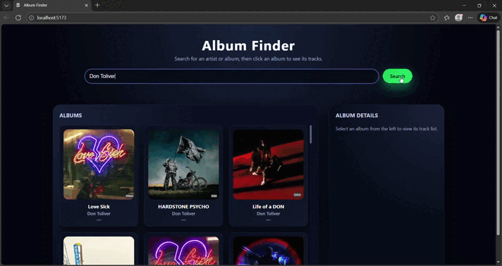

# Album Finder (Deezer API)

A web-based album search application that allows users to search for music albums and view key details such as album art, artist name, and track listings.  
The project was inspired by a Spotify Album Finder concept, but due to API access limitations, the implementation uses the **Deezer API** to fetch real-world music data.

The goal of this project was to practice working with third-party APIs, asynchronous JavaScript, and modern frontend tooling while building a clean, responsive user interface.

## 📦 Technologies

- JavaScript  
- HTML  
- CSS  
- Vite (development server & build tool)  
- Deezer API  

## 💡 Features

Here’s what you can do with the Album Finder:

### 🔍 Album Search
- Search for albums by name using a text input
- Sends asynchronous API requests to the Deezer API
- Dynamically displays search results without page reloads

### 🎵 Album Details
- Displays album cover artwork
- Shows album title and artist name
- Presents a list of tracks associated with each album (when available)

### ⚡ Real-Time API Integration
- Uses `fetch()` to retrieve live data from the Deezer API
- Handles JSON responses and updates the UI dynamically
- Includes basic error handling for empty or failed searches

### 📱 Responsive Interface
- Clean, modern layout that adapts to different screen sizes
- Designed to work smoothly on desktop and mobile devices


## 🔄 API Adaptation (Spotify → Deezer)

This project was originally designed around the **Spotify Web API**, following the concept outlined in a Codedex project.  
However, due to Spotify API authentication and access restrictions, the application was adapted to use the **Deezer API** instead.

This adjustment required:
- Updating request endpoints
- Modifying response parsing logic
- Mapping Deezer’s data structure to the existing UI design

The change provided valuable experience in **adapting software designs to real-world constraints** while preserving core functionality.

## 🚦 Running the Project Locally

To run the project on your local machine:

1. Clone or download this repository.
2. Navigate to the project directory.
3. Install dependencies:
   ```bash
   npm install
4. Start the development server:
   ```bash
   npm run dev
5. Open the local URL shown in the terminal to view the app in your browser.

## 📚 What I Learned

This project strengthened my understanding of frontend development and API-driven applications.

### 🌐 Working with External APIs
- Learned how to send and handle asynchronous API requests
- Parsed and transformed JSON data for frontend display
- Adapted to differences between API providers

### 🔄 Problem Solving & Flexibility
- Adjusted the project architecture when the original API became impractical
- Maintained functionality while switching data sources
- Improved resilience when working with third-party services

### 🎨 Frontend Development
- Built dynamic UI components using vanilla JavaScript
- Practiced responsive layout design with CSS
- Improved code organization in a Vite-based project structure

## 🍿 Demo

### 🎥 Album Search Walkthrough

This demo showcases:
- Searching for albums using the Deezer API
- Displaying album artwork and artist information
- Viewing track listings
- Responsive layout behavior

<p align="center">
  
</p>

